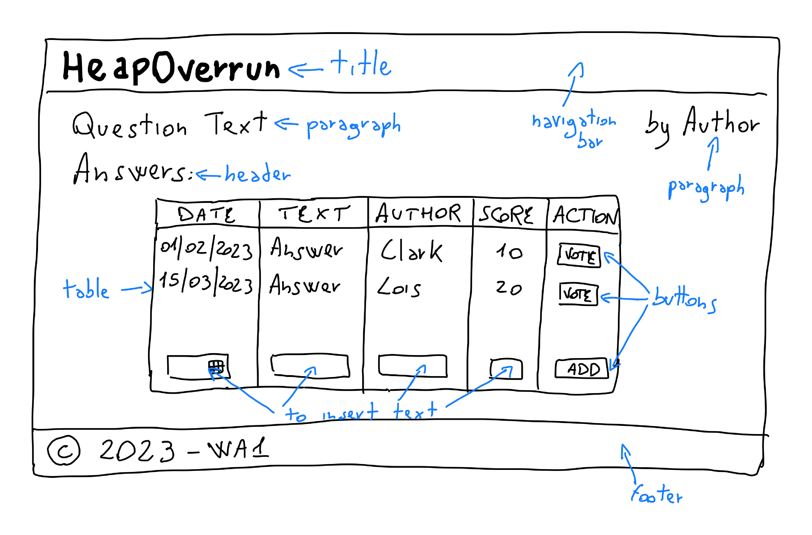

# Exercise 5: Q&A HTML+CSS skeleton

Create a prototype of the user interface of the Q&A website, using HTML and CSS.

In particular, create a page showing all the answers to a question. The page should display the information about the question, plus a table containg all the given answers. An example of the answers page is included below. 

In this exercise, the web pages must be static (no interactive features), and the reported data will be hard-coded in the HTML source.

Use the [Bootstrap](https://getbootstrap.com/) framework to help styling the layout and the appearance of the page.

